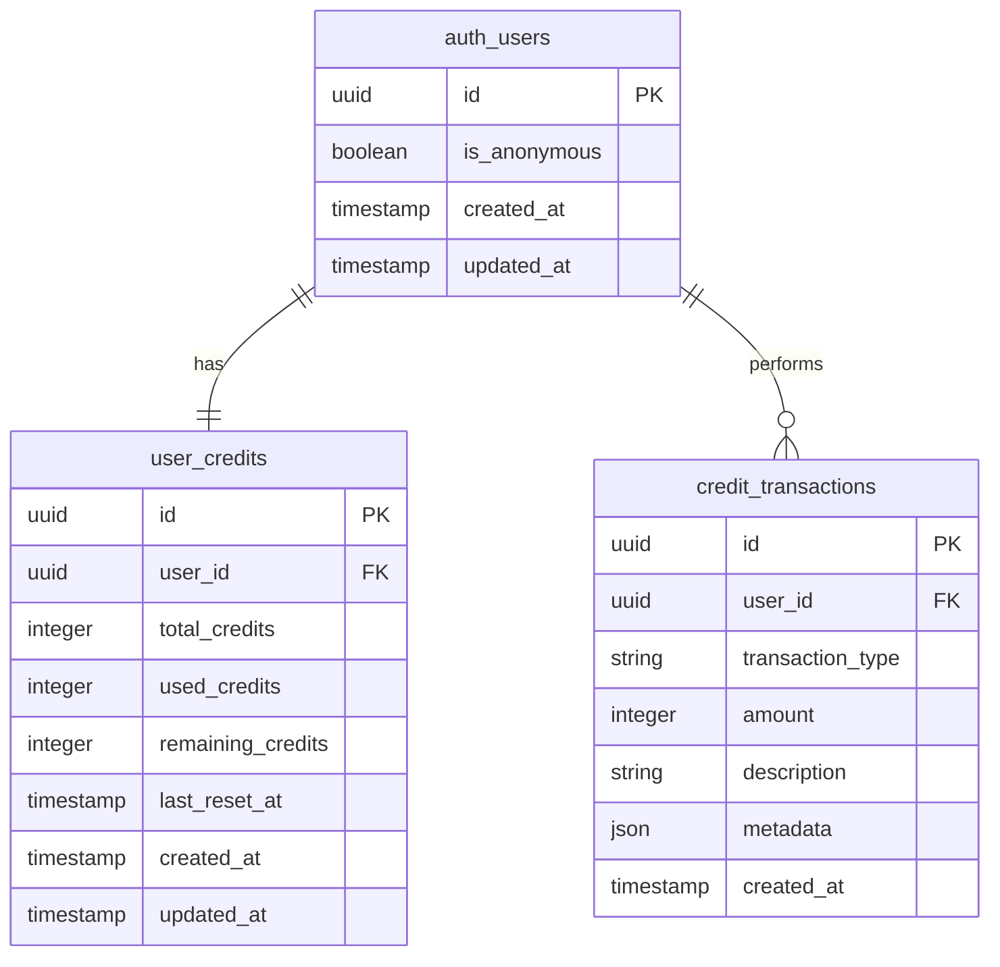
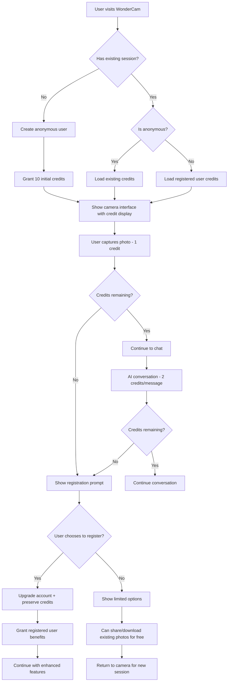

# FR-001: Anonymous User Credit System - Detailed Design Document

## Overview

This document provides a comprehensive design for implementing FR-001, the Anonymous User Credit System for WonderCam, utilizing Supabase's anonymous authentication capabilities.

## Architecture Overview

**Core Concept:** Use Supabase's anonymous authentication to create temporary user accounts that can accumulate and spend credits for photo interactions and AI conversations, with a seamless upgrade path to full registration.

## 1. Database Schema Design

### Tables Structure

```sql
-- User credits table
CREATE TABLE user_credits (
    id UUID PRIMARY KEY DEFAULT gen_random_uuid(),
    user_id UUID NOT NULL REFERENCES auth.users(id) ON DELETE CASCADE,
    total_credits INTEGER NOT NULL DEFAULT 0,
    used_credits INTEGER NOT NULL DEFAULT 0,
    remaining_credits INTEGER NOT NULL DEFAULT 0,
    last_reset_at TIMESTAMP WITH TIME ZONE DEFAULT NOW(),
    created_at TIMESTAMP WITH TIME ZONE DEFAULT NOW(),
    updated_at TIMESTAMP WITH TIME ZONE DEFAULT NOW(),
    CONSTRAINT remaining_credits_check CHECK (remaining_credits >= 0),
    CONSTRAINT used_credits_check CHECK (used_credits >= 0)
);

-- Credit transactions table
CREATE TABLE credit_transactions (
    id UUID PRIMARY KEY DEFAULT gen_random_uuid(),
    user_id UUID NOT NULL REFERENCES auth.users(id) ON DELETE CASCADE,
    transaction_type TEXT NOT NULL CHECK (transaction_type IN ('earned', 'spent', 'bonus', 'reset')),
    amount INTEGER NOT NULL,
    description TEXT NOT NULL,
    metadata JSONB DEFAULT '{}',
    created_at TIMESTAMP WITH TIME ZONE DEFAULT NOW()
);

-- Indexes for performance
CREATE INDEX idx_user_credits_user_id ON user_credits(user_id);
CREATE INDEX idx_credit_transactions_user_id ON credit_transactions(user_id);
CREATE INDEX idx_credit_transactions_created_at ON credit_transactions(created_at);
```

### Entity Relationship Diagram



## 2. Credit System Rules

### Initial Credit Allocation
- **Anonymous users:** 10 credits upon first visit
- **Registered users:** 50 credits upon registration + existing anonymous credits
- **Daily refresh:** 5 additional credits (anonymous), 20 (registered)

### Credit Costs
- **Photo capture:** 1 credit
- **AI conversation message:** 2 credits  
- **Photo sharing/download:** 0 credits (free actions)
- **Voice input:** 1 credit (same as photo capture)

### Upgrade Benefits
- Preserve all existing credits from anonymous account
- Increased daily credit allowance (5 → 20)
- Access to photo history/gallery
- Cross-device synchronization
- Priority AI response processing

## 3. Implementation Components

### A. Anonymous Authentication Service

**File:** `app/lib/services/anonymous-auth.ts`

```typescript
export interface AnonymousAuthService {
  initializeAnonymousUser(): Promise<User>
  upgradeToRegistered(email: string, password: string): Promise<User>
  getCurrentUser(): User | null
  isAnonymous(): boolean
  getOrCreateAnonymousSession(): Promise<User>
}

export class SupabaseAnonymousAuthService implements AnonymousAuthService {
  constructor(private supabase: SupabaseClient) {}
  
  async initializeAnonymousUser(): Promise<User> {
    const { data, error } = await this.supabase.auth.signInAnonymously()
    if (error) throw error
    return data.user
  }
  
  async upgradeToRegistered(email: string, password: string): Promise<User> {
    // Link email to existing anonymous account
    const { data, error } = await this.supabase.auth.updateUser({
      email,
      password
    })
    if (error) throw error
    return data.user
  }
  
  getCurrentUser(): User | null {
    return this.supabase.auth.getUser().then(({ data }) => data.user)
  }
  
  isAnonymous(): boolean {
    const user = this.getCurrentUser()
    return user?.is_anonymous || false
  }
}
```

### B. Credit Management Service

**File:** `app/lib/services/credit-service.ts`

```typescript
export enum CreditAction {
  PHOTO_CAPTURE = 'photo_capture',
  AI_MESSAGE = 'ai_message',
  VOICE_INPUT = 'voice_input',
  PHOTO_SHARE = 'photo_share'
}

export interface CreditService {
  getCurrentCredits(): Promise<number>
  consumeCredits(amount: number, action: CreditAction): Promise<boolean>
  checkCanPerformAction(action: CreditAction): Promise<boolean>
  refreshDailyCredits(): Promise<void>
  getTransactionHistory(): Promise<CreditTransaction[]>
  initializeUserCredits(userId: string): Promise<void>
}

export class SupabaseCreditService implements CreditService {
  private readonly CREDIT_COSTS = {
    [CreditAction.PHOTO_CAPTURE]: 1,
    [CreditAction.AI_MESSAGE]: 2,
    [CreditAction.VOICE_INPUT]: 1,
    [CreditAction.PHOTO_SHARE]: 0
  }
  
  private readonly INITIAL_CREDITS = {
    anonymous: 10,
    registered: 50
  }
  
  private readonly DAILY_CREDITS = {
    anonymous: 5,
    registered: 20
  }
  
  constructor(
    private supabase: SupabaseClient,
    private authService: AnonymousAuthService
  ) {}
  
  async getCurrentCredits(): Promise<number> {
    const user = await this.authService.getCurrentUser()
    if (!user) throw new Error('No user found')
    
    const { data, error } = await this.supabase
      .from('user_credits')
      .select('remaining_credits')
      .eq('user_id', user.id)
      .single()
    
    if (error) throw error
    return data.remaining_credits
  }
  
  async consumeCredits(amount: number, action: CreditAction): Promise<boolean> {
    const user = await this.authService.getCurrentUser()
    if (!user) return false
    
    const currentCredits = await this.getCurrentCredits()
    if (currentCredits < amount) return false
    
    // Update credits and create transaction in a single operation
    const { error } = await this.supabase.rpc('consume_credits', {
      p_user_id: user.id,
      p_amount: amount,
      p_action: action
    })
    
    return !error
  }
  
  async checkCanPerformAction(action: CreditAction): Promise<boolean> {
    const cost = this.CREDIT_COSTS[action]
    const currentCredits = await this.getCurrentCredits()
    return currentCredits >= cost
  }
}
```

### C. Credit Display UI Component

**File:** `app/components/credit-display.tsx`

```typescript
export interface CreditDisplayProps {
  position?: 'header' | 'floating' | 'modal'
  showUpgradePrompt?: boolean
  onUpgradeClick?: () => void
  className?: string
}

export function CreditDisplay({ 
  position = 'header', 
  showUpgradePrompt = false,
  onUpgradeClick,
  className 
}: CreditDisplayProps) {
  const [credits, setCredits] = useState<number>(0)
  const [isAnonymous, setIsAnonymous] = useState(true)
  const [isLoading, setIsLoading] = useState(true)
  
  const creditService = useCreditService()
  const authService = useAnonymousAuth()
  
  useEffect(() => {
    const loadCredits = async () => {
      try {
        const currentCredits = await creditService.getCurrentCredits()
        const anonymous = await authService.isAnonymous()
        
        setCredits(currentCredits)
        setIsAnonymous(anonymous)
      } catch (error) {
        console.error('Failed to load credits:', error)
      } finally {
        setIsLoading(false)
      }
    }
    
    loadCredits()
  }, [])
  
  const getCreditColor = () => {
    if (credits <= 2) return 'text-red-500'
    if (credits <= 5) return 'text-yellow-500'
    return 'text-green-500'
  }
  
  const shouldShowUpgrade = isAnonymous && credits <= 3
  
  return (
    <div className={cn('credit-display', className)}>
      {isLoading ? (
        <div className="animate-pulse">
          <div className="h-6 w-16 bg-gray-300 rounded"></div>
        </div>
      ) : (
        <div className="flex items-center space-x-2">
          <div className={cn('font-medium', getCreditColor())}>
            ⚡ {credits} credits
          </div>
          
          {shouldShowUpgrade && (
            <button
              onClick={onUpgradeClick}
              className="text-xs bg-blue-500 text-white px-2 py-1 rounded hover:bg-blue-600 transition-colors"
            >
              Get More
            </button>
          )}
        </div>
      )}
    </div>
  )
}
```

## 4. User Flow Design



## 5. Integration Points

### A. Modified Authentication Flow (`app/app/wondercam/page.tsx`)

```typescript
// Replace current authentication check
useEffect(() => {
  const initializeUser = async () => {
    try {
      let { data: { user } } = await supabase.auth.getUser()
      
      if (!user) {
        // Create anonymous user automatically
        user = await anonymousAuthService.initializeAnonymousUser()
        console.log('Created anonymous user:', user.id)
      }
      
      // Initialize credits for this user (idempotent)
      await creditService.initializeUserCredits(user.id)
      
      setAppState(prev => ({ 
        ...prev, 
        user,
        isAnonymous: user.is_anonymous || false
      }))
      
    } catch (error) {
      console.error('Failed to initialize user:', error)
      setAppState(prev => ({ ...prev, error: error.message }))
    }
  }
  
  initializeUser()
}, [])
```

### B. Credit Validation in Actions

```typescript
// Modified photo capture with credit check
const handlePhotoCapture = async (photo: CapturedPhoto) => {
  const canCapture = await creditService.checkCanPerformAction(CreditAction.PHOTO_CAPTURE)
  
  if (!canCapture) {
    setShowUpgradePrompt(true)
    return
  }
  
  const success = await creditService.consumeCredits(1, CreditAction.PHOTO_CAPTURE)
  if (!success) {
    setAppState(prev => ({ ...prev, error: 'Failed to consume credits' }))
    return
  }
  
  // Continue with existing photo capture logic
  setAppState(prev => ({
    ...prev,
    currentPhoto: photo,
    currentMode: 'chat',
    activeSession: {
      sessionId: crypto.randomUUID(),
      photo,
      messages: [],
      language: prev.language,
      isActive: true,
      createdAt: new Date()
    }
  }))
}

// Modified message handling with credit check
const handleMessage = async (message: string) => {
  if (!appState.activeSession || !appState.currentPhoto) return
  
  const canSend = await creditService.checkCanPerformAction(CreditAction.AI_MESSAGE)
  
  if (!canSend) {
    setShowUpgradePrompt(true)
    return
  }
  
  const success = await creditService.consumeCredits(2, CreditAction.AI_MESSAGE)
  if (!success) {
    setAppState(prev => ({ ...prev, error: 'Insufficient credits' }))
    return
  }
  
  // Continue with existing message logic
  // ... existing implementation
}
```

## 6. Row-Level Security (RLS) Policies

```sql
-- Enable RLS on credit tables
ALTER TABLE user_credits ENABLE ROW LEVEL SECURITY;
ALTER TABLE credit_transactions ENABLE ROW LEVEL SECURITY;

-- Users can only access their own credit records
CREATE POLICY "Users can view own credits" ON user_credits
FOR SELECT USING (auth.uid() = user_id);

CREATE POLICY "Users can update own credits" ON user_credits
FOR UPDATE USING (auth.uid() = user_id);

CREATE POLICY "Users can insert own credits" ON user_credits
FOR INSERT WITH CHECK (auth.uid() = user_id);

-- Users can view their own credit transactions
CREATE POLICY "Users can view own transactions" ON credit_transactions
FOR SELECT USING (auth.uid() = user_id);

-- System can insert transactions (via service role or stored procedures)
CREATE POLICY "System can insert transactions" ON credit_transactions
FOR INSERT WITH CHECK (true);

-- Stored procedure for atomic credit consumption
CREATE OR REPLACE FUNCTION consume_credits(
  p_user_id UUID,
  p_amount INTEGER,
  p_action TEXT
) RETURNS BOOLEAN AS $$
DECLARE
  current_credits INTEGER;
BEGIN
  -- Get current credits with row lock
  SELECT remaining_credits INTO current_credits
  FROM user_credits
  WHERE user_id = p_user_id
  FOR UPDATE;
  
  -- Check if sufficient credits
  IF current_credits < p_amount THEN
    RETURN FALSE;
  END IF;
  
  -- Update credits
  UPDATE user_credits
  SET 
    used_credits = used_credits + p_amount,
    remaining_credits = remaining_credits - p_amount,
    updated_at = NOW()
  WHERE user_id = p_user_id;
  
  -- Insert transaction record
  INSERT INTO credit_transactions (user_id, transaction_type, amount, description)
  VALUES (p_user_id, 'spent', p_amount, p_action);
  
  RETURN TRUE;
END;
$$ LANGUAGE plpgsql SECURITY DEFINER;
```

## 7. Upgrade Flow Design

### Upgrade Prompt Component

**File:** `app/components/upgrade-prompt.tsx`

```typescript
export interface UpgradePromptProps {
  isVisible: boolean
  onClose: () => void
  currentCredits: number
  trigger: 'exhausted' | 'proactive'
}

export function UpgradePrompt({ 
  isVisible, 
  onClose, 
  currentCredits, 
  trigger 
}: UpgradePromptProps) {
  const [email, setEmail] = useState('')
  const [password, setPassword] = useState('')
  const [isLoading, setIsLoading] = useState(false)
  
  const authService = useAnonymousAuth()
  const creditService = useCreditService()
  
  const benefits = [
    `Keep your ${currentCredits} existing credits`,
    'Get 50 bonus credits immediately',
    'Receive 20 credits daily (vs 5 for anonymous)',
    'Access photo gallery and history',
    'Cross-device synchronization',
    'Priority AI response times'
  ]
  
  const handleUpgrade = async (e: React.FormEvent) => {
    e.preventDefault()
    setIsLoading(true)
    
    try {
      await authService.upgradeToRegistered(email, password)
      
      // Credits are automatically preserved via user_id continuity
      // Grant bonus credits for registration
      await creditService.grantBonusCredits(50, 'registration_bonus')
      
      onClose()
    } catch (error) {
      console.error('Upgrade failed:', error)
      // Handle error display
    } finally {
      setIsLoading(false)
    }
  }
  
  if (!isVisible) return null
  
  return (
    <div className="fixed inset-0 bg-black bg-opacity-50 flex items-center justify-center z-50">
      <div className="bg-white rounded-lg p-6 max-w-md w-full mx-4">
        <h2 className="text-xl font-bold mb-4">
          {trigger === 'exhausted' ? 'Out of Credits!' : 'Upgrade Your Account'}
        </h2>
        
        <div className="mb-4">
          <h3 className="font-medium mb-2">Upgrade Benefits:</h3>
          <ul className="text-sm space-y-1">
            {benefits.map((benefit, index) => (
              <li key={index} className="flex items-center">
                <span className="text-green-500 mr-2">✓</span>
                {benefit}
              </li>
            ))}
          </ul>
        </div>
        
        <form onSubmit={handleUpgrade} className="space-y-4">
          <input
            type="email"
            placeholder="Email"
            value={email}
            onChange={(e) => setEmail(e.target.value)}
            className="w-full px-3 py-2 border rounded-md"
            required
          />
          <input
            type="password"
            placeholder="Password"
            value={password}
            onChange={(e) => setPassword(e.target.value)}
            className="w-full px-3 py-2 border rounded-md"
            required
          />
          
          <div className="flex space-x-3">
            <button
              type="submit"
              disabled={isLoading}
              className="flex-1 bg-blue-500 text-white py-2 rounded-md hover:bg-blue-600 disabled:opacity-50"
            >
              {isLoading ? 'Creating Account...' : 'Create Account'}
            </button>
            <button
              type="button"
              onClick={onClose}
              className="px-4 py-2 text-gray-600 border rounded-md hover:bg-gray-50"
            >
              Cancel
            </button>
          </div>
        </form>
      </div>
    </div>
  )
}
```

## 8. Edge Cases and Fallbacks

### A. Network Issues
- Cache credit count locally using localStorage
- Sync when connection is restored
- Show offline indicator when disconnected

### B. Storage Cleared
- Graceful re-initialization with new anonymous account
- Clear messaging about lost session
- Encourage registration to prevent future loss

### C. Upgrade Failures
- Preserve anonymous session as fallback
- Retry mechanism for network errors
- Clear error messaging with support contact

### D. Credit Exhaustion
- Always provide free actions (share, download existing photos)
- Clear upgrade path with immediate benefits shown
- Allow browsing existing conversation history

### E. Abuse Prevention
- Rate limiting on account creation
- Device fingerprinting for excessive resets
- Monitoring for suspicious patterns
- IP-based throttling as secondary measure

## 9. Performance Considerations

### A. Client-Side Caching
```typescript
// Cache credits in memory and localStorage
class CreditCache {
  private static CACHE_KEY = 'wondercam_credits'
  private static CACHE_TTL = 5 * 60 * 1000 // 5 minutes
  
  static get(): number | null {
    const cached = localStorage.getItem(this.CACHE_KEY)
    if (!cached) return null
    
    const { value, timestamp } = JSON.parse(cached)
    if (Date.now() - timestamp > this.CACHE_TTL) return null
    
    return value
  }
  
  static set(credits: number): void {
    localStorage.setItem(this.CACHE_KEY, JSON.stringify({
      value: credits,
      timestamp: Date.now()
    }))
  }
}
```

### B. Optimistic Updates
- Update UI immediately for better UX
- Sync with server in background
- Rollback on failure with user notification

### C. Database Optimization
- Indexes on frequently queried columns
- Stored procedures for complex operations
- Connection pooling for scalability

## 10. Success Metrics

### A. Technical Metrics
- **Authentication Success Rate:** > 99% for anonymous signin
- **Credit API Response Time:** < 200ms average
- **Upgrade Conversion Rate:** > 15% of anonymous users
- **Error Rate:** < 1% for credit operations

### B. User Experience Metrics
- **Session Duration:** Anonymous vs registered comparison
- **Feature Usage:** Credits consumed per session type
- **Retention Rate:** 7-day return rate for anonymous users
- **Satisfaction:** User feedback on credit system

### C. Business Metrics
- **Registration Conversion:** Anonymous to registered user rate
- **Engagement Depth:** Actions per session before/after upgrade
- **Revenue Impact:** Premium feature adoption post-registration

## 11. Implementation Timeline

### Phase 1: Foundation (Days 1-2)
- Database schema creation
- RLS policies implementation
- Anonymous auth service development
- Basic credit service implementation

### Phase 2: Integration (Days 3-4)
- Credit validation in existing flows
- UI component development
- Cache implementation
- Error handling

### Phase 3: Enhancement (Days 5-6)
- Upgrade flow implementation
- Edge case handling
- Performance optimization
- Testing and debugging

### Phase 4: Polish (Day 7)
- UI/UX refinement
- Documentation completion
- Monitoring setup
- Go-live preparation

This comprehensive design provides a robust foundation for implementing the anonymous user credit system while maintaining excellent user experience and providing clear incentives for registration.