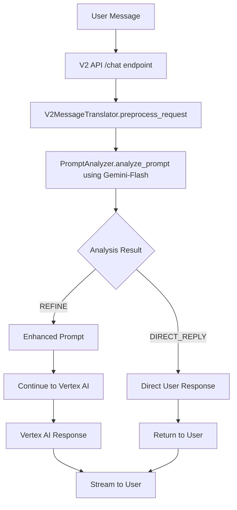

# 🧠 Intelligent Prompt Analysis System - Implementation Plan

## Overview

This document outlines the complete implementation plan for adding intelligent prompt analysis to the WonderCam V2 API using Gemini-Flash. The system will analyze user messages and either:

1. **REFINE**: Enhance unclear prompts and continue to Vertex AI
2. **DIRECT_REPLY**: Respond directly to inappropriate/unclear requests and stop processing
3. **PASS_THROUGH**: Continue with original prompt unchanged

## Architecture



## Integration Points Analysis ✅

**Current V2 API Flow:**
1. **Entry Point**: `api/v2_api.py` - `/v2/chat` endpoint
2. **Preprocessing Hook**: `api/v2_translator.py` - `preprocess_request()` method (lines 76-124)
3. **Response Flow**: `api/v2_api.py` - `stream_v2_response()` function (lines 41-105)

**Perfect Integration Point**: The `preprocess_request()` method is exactly where we need to integrate the prompt analysis!

## Implementation Files

### 1. New File: `api/prompt_analyzer.py`

**Core PromptAnalyzer class with Gemini-Flash integration:**

```python
"""
Intelligent Prompt Analysis Service using Gemini-Flash
Analyzes user prompts and decides whether to refine or reply directly
"""

from typing import Dict, Any, Optional, Tuple, List
from enum import Enum
import httpx
import json
import logging
from dataclasses import dataclass
import time

from auth_handler import AuthenticationHandler
from config import settings

logger = logging.getLogger(__name__)

class AnalysisAction(str, Enum):
    """Possible actions from prompt analysis"""
    REFINE = "refine"           # Refine prompt and continue to Vertex AI
    DIRECT_REPLY = "direct_reply"  # Reply directly to user, stop processing
    PASS_THROUGH = "pass_through"  # Pass original prompt through unchanged

@dataclass
class PromptAnalysisResult:
    """Result of prompt analysis"""
    action: AnalysisAction
    refined_prompt: Optional[str] = None
    direct_reply: Optional[str] = None
    confidence: float = 0.0
    reasoning: Optional[str] = None
    metadata: Optional[Dict[str, Any]] = None

class PromptAnalyzer:
    """Intelligent prompt analyzer using Gemini-Flash"""
    
    def __init__(self, project_id: str, auth_handler: AuthenticationHandler):
        self.project_id = project_id
        self.auth_handler = auth_handler
        self.analysis_prompts = self._load_analysis_prompts()
    
    def _load_analysis_prompts(self) -> Dict[str, str]:
        """Load system prompts for different analysis types"""
        return {
            "main_analysis": """You are a smart prompt refinement AI. Your job is to analyze user messages and decide:

1. REFINE: If the message is unclear, too vague, or could benefit from enhancement - provide a refined version
2. DIRECT_REPLY: If the message is inappropriate, nonsensical, or should be declined - provide a direct response
3. PASS_THROUGH: If the message is clear and appropriate as-is

User message: "{user_message}"

Respond in JSON format:
{{
  "action": "refine|direct_reply|pass_through",
  "refined_prompt": "enhanced version if action=refine",
  "direct_reply": "direct response if action=direct_reply", 
  "confidence": 0.85,
  "reasoning": "explanation of your decision"
}}

Rules:
- REFINE for vague requests like "help me", "what can you do", unclear questions
- DIRECT_REPLY for inappropriate content, spam, gibberish, impossible requests
- PASS_THROUGH for clear, specific, reasonable requests
- Always include confidence score 0.0-1.0""",

            "image_analysis": """Analyze this user message that includes an image. Decide if the request is:

1. REFINE: Unclear what they want to know about the image - enhance the prompt
2. DIRECT_REPLY: Inappropriate image request or problematic content
3. PASS_THROUGH: Clear image analysis request

User message: "{user_message}"
Has image: Yes

Respond in JSON format with action, refined_prompt/direct_reply, confidence, and reasoning.""",

            "creative_requests": """This appears to be a creative request. Analyze if it should be:

1. REFINE: Vague creative request that needs specificity
2. DIRECT_REPLY: Inappropriate creative content request
3. PASS_THROUGH: Well-defined creative request

User message: "{user_message}"

Focus on enhancing creative prompts with specific style, format, or detail requirements."""
        }
    
    async def analyze_prompt(
        self, 
        user_message: str, 
        has_images: bool = False,
        context: Optional[Dict[str, Any]] = None
    ) -> PromptAnalysisResult:
        """
        Analyze user prompt using Gemini-Flash and determine action
        """
        try:
            # Choose appropriate analysis prompt
            if has_images:
                system_prompt = self.analysis_prompts["image_analysis"].format(
                    user_message=user_message
                )
            elif any(word in user_message.lower() for word in ["generate", "create", "draw", "write", "make"]):
                system_prompt = self.analysis_prompts["creative_requests"].format(
                    user_message=user_message
                )
            else:
                system_prompt = self.analysis_prompts["main_analysis"].format(
                    user_message=user_message
                )
            
            # Call Gemini-Flash for analysis
            analysis_response = await self._call_gemini_flash(system_prompt)
            
            # Parse response
            result = self._parse_analysis_response(analysis_response)
            
            logger.info(f"Prompt analysis complete: {result.action} (confidence: {result.confidence})")
            return result
            
        except Exception as e:
            logger.error(f"Prompt analysis failed: {e}")
            # Fallback to pass-through on error
            return PromptAnalysisResult(
                action=AnalysisAction.PASS_THROUGH,
                reasoning=f"Analysis failed, defaulting to pass-through: {str(e)}",
                confidence=0.0
            )
    
    async def _call_gemini_flash(self, prompt: str) -> str:
        """Call Gemini-Flash via Vertex AI for prompt analysis"""
        
        endpoint = f"https://aiplatform.googleapis.com/v1/projects/{self.project_id}/locations/{settings.vertex_ai_location}/publishers/google/models/{settings.prompt_analysis_model}:generateContent"
        
        request_body = {
            "contents": [{
                "role": "user",
                "parts": [{"text": prompt}]
            }],
            "generationConfig": {
                "temperature": settings.prompt_analysis_temperature,
                "maxOutputTokens": 500,
                "topP": 0.8
            },
            "safetySettings": [
                {"category": "HARM_CATEGORY_HATE_SPEECH", "threshold": "OFF"},
                {"category": "HARM_CATEGORY_SEXUALLY_EXPLICIT", "threshold": "OFF"},
                {"category": "HARM_CATEGORY_HARASSMENT", "threshold": "OFF"},
                {"category": "HARM_CATEGORY_DANGEROUS_CONTENT", "threshold": "OFF"}
            ]
        }
        
        headers = {
            "Authorization": f"Bearer {self.auth_handler.get_access_token()}",
            "Content-Type": "application/json"
        }
        
        async with httpx.AsyncClient(timeout=settings.prompt_analysis_timeout) as client:
            response = await client.post(endpoint, headers=headers, json=request_body)
            
            if not response.is_success:
                raise Exception(f"Gemini-Flash call failed: {response.status_code} - {response.text}")
            
            data = response.json()
            
            # Extract text from response
            if data.get("candidates") and len(data["candidates"]) > 0:
                candidate = data["candidates"][0]
                if candidate.get("content", {}).get("parts"):
                    for part in candidate["content"]["parts"]:
                        if part.get("text"):
                            return part["text"]
            
            raise Exception("No valid response from Gemini-Flash")
    
    def _parse_analysis_response(self, response: str) -> PromptAnalysisResult:
        """Parse JSON response from Gemini-Flash analysis"""
        try:
            # Try to extract JSON from response
            response = response.strip()
            if response.startswith("```json"):
                response = response[7:-3].strip()
            elif response.startswith("```"):
                response = response[3:-3].strip()
            
            data = json.loads(response)
            
            action = AnalysisAction(data.get("action", "pass_through"))
            
            return PromptAnalysisResult(
                action=action,
                refined_prompt=data.get("refined_prompt"),
                direct_reply=data.get("direct_reply"),
                confidence=float(data.get("confidence", 0.0)),
                reasoning=data.get("reasoning"),
                metadata=data.get("metadata", {})
            )
            
        except Exception as e:
            logger.error(f"Failed to parse analysis response: {e}")
            logger.error(f"Raw response: {response}")
            
            # Fallback parsing
            return PromptAnalysisResult(
                action=AnalysisAction.PASS_THROUGH,
                reasoning=f"Parse error, using fallback: {str(e)}",
                confidence=0.0
            )
```

### 2. Enhanced Models: `api/v2_models.py`

**Add these new model classes:**

```python
# Add to existing v2_models.py

class PromptAnalysisResult(BaseModel):
    """Result of intelligent prompt analysis"""
    action: str = Field(description="Analysis action: refine, direct_reply, pass_through")
    refined_prompt: Optional[str] = Field(default=None, description="Enhanced prompt if action=refine")
    direct_reply: Optional[str] = Field(default=None, description="Direct response if action=direct_reply") 
    confidence: float = Field(description="Confidence score 0.0-1.0")
    reasoning: Optional[str] = Field(default=None, description="Explanation of decision")
    processing_time_ms: Optional[int] = Field(default=None, description="Analysis processing time")

class V2AnalysisMessage(BaseModel):
    """System message for prompt analysis results"""
    type: str = Field(default="analysis", description="Message type")
    analysis: PromptAnalysisResult = Field(description="Analysis result")
    original_message: str = Field(description="Original user message")
    timestamp: str = Field(description="Analysis timestamp")
```

### 3. Enhanced V2MessageTranslator: `api/v2_translator.py`

**Key modifications to integrate prompt analysis:**

```python
# Add imports
from prompt_analyzer import PromptAnalyzer, AnalysisAction
import time

# Modify __init__ method
def __init__(self, project_id: str):
    self.project_id = project_id
    self.language_instructions = { ... } # existing code
    
    # Initialize prompt analyzer if enabled
    if settings.prompt_analysis_enabled:
        self.auth_handler = AuthenticationHandler(
            credentials_path=settings.google_application_credentials
        )
        self.prompt_analyzer = PromptAnalyzer(project_id, self.auth_handler)
    else:
        self.prompt_analyzer = None

# Enhanced preprocess_request method
async def preprocess_request(self, request: V2ChatRequest) -> AsyncGenerator[V2ResponseChunk, None]:
    """Enhanced preprocessing with intelligent prompt analysis"""
    
    logger.info(f"🧠 Starting intelligent preprocessing for {len(request.contents)} content parts")
    
    # Step 1: Extract text content for analysis  
    text_parts = [part.text for part in request.contents if part.text]
    image_parts = [part for part in request.contents if part.inlineData and 
                  part.inlineData.get("mimeType", "").startswith("image/")]
    
    # Step 2: Perform intelligent analysis if enabled and text content exists
    if self.prompt_analyzer and text_parts and settings.prompt_analysis_enabled:
        combined_text = " ".join(text_parts)
        has_images = len(image_parts) > 0
        
        start_time = time.time()
        
        yield V2ResponseChunk(
            type="system",
            content=V2SystemMessage(
                type="analysis_start",
                content="Analyzing your message for optimal processing...",
            ).model_dump()
        )
        
        analysis_result = await self.prompt_analyzer.analyze_prompt(
            combined_text, 
            has_images=has_images,
            context={"language": request.language}
        )
        
        processing_time = int((time.time() - start_time) * 1000)
        
        # Handle analysis result
        if analysis_result.action == AnalysisAction.DIRECT_REPLY:
            # Return direct reply to user, stop processing
            logger.info(f"🛑 Direct reply triggered: {analysis_result.reasoning}")
            
            yield V2ResponseChunk(
                type="system", 
                content=V2SystemMessage(
                    type="analysis_complete",
                    content="Analysis complete - providing direct response",
                ).model_dump()
            )
            
            yield V2ResponseChunk(
                type="text",
                content=analysis_result.direct_reply,
                is_final=True,
                metadata={
                    "source": "prompt_analyzer",
                    "analysis_action": "direct_reply",
                    "confidence": analysis_result.confidence,
                    "processing_time_ms": processing_time
                }
            )
            
            # Signal to stop further processing
            request._stop_processing = True
            return
            
        elif analysis_result.action == AnalysisAction.REFINE:
            # Update request with refined prompt
            logger.info(f"✨ Prompt refined: {analysis_result.reasoning}")
            
            yield V2ResponseChunk(
                type="system",
                content=V2SystemMessage(
                    type="prompt_refined", 
                    content=f"I've enhanced your request for better results.",
                ).model_dump()
            )
            
            # Replace original text with refined version
            for i, part in enumerate(request.contents):
                if part.text:
                    request.contents[i].text = analysis_result.refined_prompt
                    break
        
        else:  # PASS_THROUGH
            logger.info(f"➡️ Passing through original prompt: {analysis_result.reasoning}")
            
            yield V2ResponseChunk(
                type="system",
                content=V2SystemMessage(
                    type="analysis_complete",
                    content="Your message is clear and ready for processing.",
                ).model_dump()
            )
    
    # Continue with existing preprocessing logic...
    # ... rest of existing validation code
```

### 4. Enhanced V2 API Handler: `api/v2_api.py`

**Modify the stream_v2_response function:**

```python
async def stream_v2_response(request: V2ChatRequest, user: dict) -> AsyncGenerator[str, None]:
    """Enhanced V2 API response with intelligent preprocessing"""
    
    try:
        current_translator = get_translator()
        
        # Step 1: Intelligent preprocessing
        logger.info("🧠 Starting intelligent preprocessing...")
        preprocessing_stopped = False
        
        async for preprocess_chunk in current_translator.preprocess_request(request):
            chunk_json = json.dumps(preprocess_chunk.model_dump())
            yield f"data: {chunk_json}\n\n"
            
            # Check if preprocessing decided to stop (direct reply)
            if hasattr(request, '_stop_processing') and request._stop_processing:
                preprocessing_stopped = True
                break
        
        # If preprocessing stopped, don't continue to Vertex AI
        if preprocessing_stopped:
            logger.info("🛑 Preprocessing stopped - direct reply sent")
            return
        
        # Step 2: Continue with Vertex AI (existing logic)
        logger.info("➡️ Continuing to Vertex AI with processed request...")
        # ... rest of existing Vertex AI call logic remains the same
        
    except Exception as e:
        # ... existing error handling
```

### 5. Configuration Updates: `api/config.py`

**Add prompt analysis settings:**

```python
class Settings(BaseSettings):
    # ... existing settings
    
    # Prompt Analysis Configuration
    prompt_analysis_enabled: bool = True
    prompt_analysis_model: str = "gemini-2.5-flash"
    prompt_analysis_temperature: float = 0.3
    prompt_analysis_timeout: int = 30
    prompt_analysis_confidence_threshold: float = 0.7
    
    # Analysis behavior settings
    enable_direct_replies: bool = True
    enable_prompt_refinement: bool = True
    log_analysis_decisions: bool = True
```

## Example Analysis Scenarios

### Scenario 1: Vague Request → REFINE
```
Input: "help me"
Analysis: REFINE
Output: "I'd like assistance with a specific task. Could you help me understand what you're looking for? For example: creative writing, problem-solving, analysis, coding help, or general questions?"
```

### Scenario 2: Inappropriate Content → DIRECT_REPLY
```
Input: "hack into my neighbor's wifi"
Analysis: DIRECT_REPLY  
Output: "I can't help with activities that might violate others' privacy or security. If you're having internet connectivity issues, I'd be happy to suggest legitimate troubleshooting steps."
```

### Scenario 3: Clear Request → PASS_THROUGH
```
Input: "Analyze this photo and tell me what architectural style this building represents"
Analysis: PASS_THROUGH
Action: Continue to Vertex AI with original prompt
```

## Implementation Steps

1. **Create `prompt_analyzer.py`** - Core analysis service
2. **Update `v2_models.py`** - Add new data structures
3. **Enhance `v2_translator.py`** - Integrate analysis in preprocessing
4. **Modify `v2_api.py`** - Handle stop processing signals
5. **Update `config.py`** - Add configuration options
6. **Test integration** - Verify all scenarios work correctly
7. **Add monitoring** - Log analysis decisions and performance

## Benefits

1. **🎯 Smart Filtering**: Automatically handles inappropriate requests
2. **✨ Prompt Enhancement**: Improves vague requests for better AI responses  
3. **💰 Cost Optimization**: Prevents unnecessary Vertex AI calls
4. **🔄 Seamless Integration**: Works within existing V2 API flow
5. **📈 Scalable**: Easy to add new analysis rules
6. **🔍 Observable**: Full logging and monitoring

## Testing Strategy

- **Unit tests** for PromptAnalyzer class
- **Integration tests** for V2 API flow
- **End-to-end tests** for all three scenarios (REFINE, DIRECT_REPLY, PASS_THROUGH)
- **Performance tests** for analysis latency
- **Load tests** for concurrent requests

This architecture perfectly leverages the existing preprocessing hook and adds intelligent decision-making using Gemini-Flash before expensive Vertex AI calls.