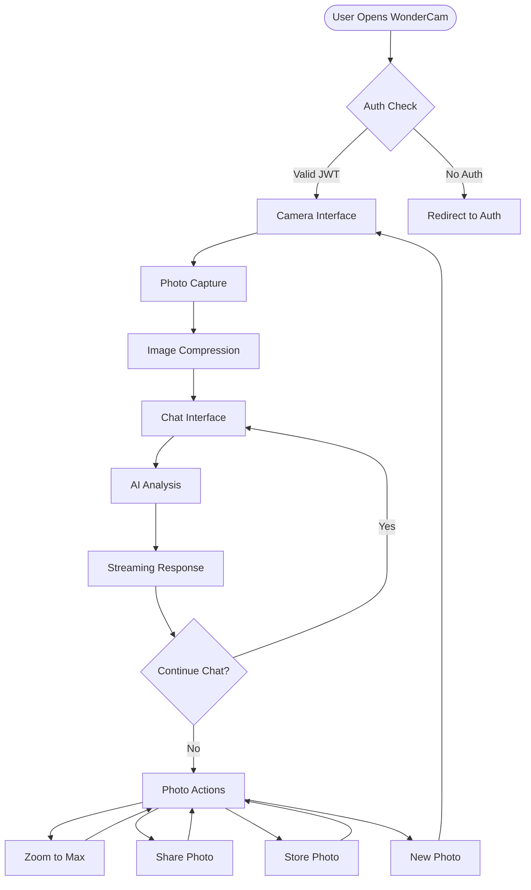
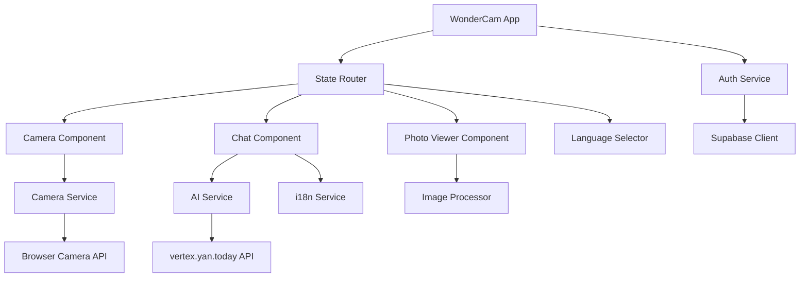
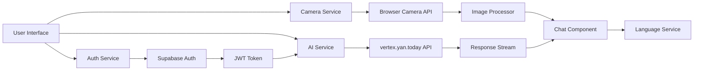
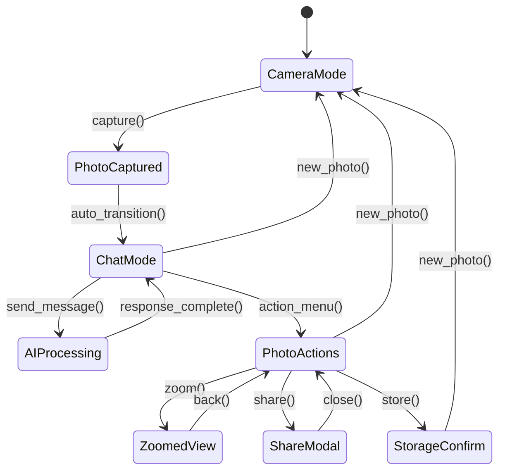

# Design Document: WonderCam

## System Architecture Overview

**WonderCam** is a session-based conversational AI camera application built upon the proven HTML5-Webcam-Photobooth foundation, enhanced with Supabase authentication and real-time AI chat capabilities.

### Core Architecture Principles

- **Session-Based**: No data persistence - resets to camera mode when closed
- **Component-Driven**: Modular design with clear separation of concerns
- **Mobile-First**: Responsive design optimized for all device sizes
- **Stream-Processing**: Real-time AI responses with progressive enhancement
- **Authentication-Integrated**: Seamless Supabase JWT integration

## Application Flow Architecture



## Component Architecture



## Data Flow Architecture



## Component State Management



## File Structure Design

```
/app/
├── index.html              # Entry point
├── app.js                 # Main application controller
├── styles/
│   ├── main.css           # Global styles
│   ├── camera.css         # Camera component styles
│   ├── chat.css           # Chat interface styles
│   ├── photo-viewer.css   # Photo viewer styles
│   └── responsive.css     # Media queries
├── components/
│   ├── camera/
│   │   ├── camera.js      # Camera component logic
│   │   └── camera-ui.js   # Camera UI controls
│   ├── chat/
│   │   ├── chat.js        # Chat component logic
│   │   ├── message.js     # Individual message component
│   │   └── streaming.js   # AI response streaming
│   ├── photo-viewer/
│   │   ├── viewer.js      # Photo display logic
│   │   └── actions.js     # Photo action controls
│   └── language/
│       ├── selector.js    # Language switching
│       └── i18n.js        # Internationalization
├── services/
│   ├── auth-service.js    # Supabase authentication
│   ├── camera-service.js  # Camera operations
│   ├── ai-service.js      # AI API integration
│   └── image-processor.js # Photo compression/processing
├── utils/
│   ├── constants.js       # App configuration
│   ├── error-handler.js   # Error management
│   └── stream-parser.js   # API response parsing
└── assets/
    ├── icons/            # UI icons
    └── translations/     # Language files
        ├── en.json
        ├── zh.json
        ├── es.json
        ├── fr.json
        └── ja.json
```

## TypeScript Interface Definitions

### Core Domain Types

```typescript
// User and Authentication
interface User {
  readonly id: string;
  readonly email: string;
  readonly jwtToken: string;
  readonly preferredLanguage: SupportedLanguage;
}

interface AuthSession {
  readonly user: User;
  readonly expiresAt: Date;
  readonly isValid: boolean;
}

// Photo and Media Types
interface CapturedPhoto {
  readonly id: string;
  readonly imageData: string;        // Original base64
  readonly compressedData: string;   // Compressed for AI
  readonly capturedAt: Date;
  readonly dimensions: PhotoDimensions;
  readonly fileSize: number;
}

interface PhotoDimensions {
  readonly width: number;
  readonly height: number;
  readonly aspectRatio: number;
}

// Chat and Conversation Types
interface ChatMessage {
  readonly id: string;
  readonly role: 'user' | 'assistant';
  readonly content: string;
  readonly timestamp: Date;
  readonly isStreaming?: boolean;
  readonly photoContext?: string;
}

interface ChatSession {
  readonly sessionId: string;
  readonly photo: CapturedPhoto;
  readonly messages: ChatMessage[];
  readonly language: SupportedLanguage;
  readonly isActive: boolean;
  readonly createdAt: Date;
}

// Application State Types
interface AppState {
  readonly currentMode: AppMode;
  readonly user: User | null;
  readonly activeSession: ChatSession | null;
  readonly currentPhoto: CapturedPhoto | null;
  readonly isLoading: boolean;
  readonly error: AppError | null;
}

type AppMode = 'camera' | 'chat' | 'photo-actions' | 'zoomed';
type SupportedLanguage = 'en' | 'zh' | 'es' | 'fr' | 'ja';
type PhotoAction = 'zoom' | 'share' | 'store' | 'new';
```

### Service Interface Definitions

```typescript
// Authentication Service
interface AuthService {
  getCurrentUser(): Promise<User | null>;
  getJWTToken(): string | null;
  validateToken(): Promise<boolean>;
  onAuthStateChange(callback: (user: User | null) => void): void;
}

// Camera Service
interface CameraService {
  getAvailableCameras(): Promise<MediaDeviceInfo[]>;
  startCamera(deviceId?: string): Promise<MediaStream>;
  capturePhoto(): Promise<CapturedPhoto>;
  switchCamera(): Promise<void>;
  stopCamera(): void;
  isSupported(): boolean;
}

// AI Service
interface AIService {
  analyzePhoto(photo: CapturedPhoto, message: string, language: SupportedLanguage): Promise<AsyncIterable<string>>;
  continueConversation(session: ChatSession, message: string): Promise<AsyncIterable<string>>;
  handleError(error: AIError): UserFriendlyError;
}

// Image Processing Service
interface ImageProcessor {
  compressImage(imageData: string, quality: number): Promise<string>;
  resizeImage(imageData: string, maxWidth: number, maxHeight: number): Promise<string>;
  getImageDimensions(imageData: string): Promise<PhotoDimensions>;
  validateImage(imageData: string): boolean;
}
```

### Component Interface Definitions

```typescript
// Camera Component
interface CameraComponentProps {
  user: User;
  onPhotoCapture: (photo: CapturedPhoto) => void;
  onError: (error: AppError) => void;
}

interface CameraComponentState {
  stream: MediaStream | null;
  availableCameras: MediaDeviceInfo[];
  currentCameraIndex: number;
  isCapturing: boolean;
  hasPermission: boolean;
}

// Chat Component
interface ChatComponentProps {
  session: ChatSession;
  onMessage: (message: string) => void;
  onNewPhoto: () => void;
  onPhotoAction: (action: PhotoAction) => void;
  onLanguageChange: (language: SupportedLanguage) => void;
}

interface ChatComponentState {
  messages: ChatMessage[];
  currentMessage: string;
  isStreaming: boolean;
  streamingMessageId: string | null;
}

// Photo Viewer Component
interface PhotoViewerProps {
  photo: CapturedPhoto;
  onZoom: () => void;
  onShare: () => void;
  onStore: () => void;
  onBack: () => void;
}

interface PhotoViewerState {
  isZoomed: boolean;
  zoomLevel: number;
  panPosition: { x: number; y: number };
}
```

## API Integration Design

### Authentication Integration

```typescript
class SupabaseAuthService implements AuthService {
  private supabase: SupabaseClient;
  
  constructor() {
    this.supabase = createClient(SUPABASE_URL, SUPABASE_ANON_KEY);
  }
  
  async getCurrentUser(): Promise<User | null> {
    const { data: { session } } = await this.supabase.auth.getSession();
    if (!session?.user) return null;
    
    return {
      id: session.user.id,
      email: session.user.email!,
      jwtToken: session.access_token,
      preferredLanguage: this.getStoredLanguage() || 'en'
    };
  }
  
  getJWTToken(): string | null {
    return this.supabase.auth.getSession()?.data.session?.access_token || null;
  }
}
```

### AI Service Integration

```typescript
class GeminiAIService implements AIService {
  private readonly apiEndpoint = 'https://vertex.yan.today';
  
  async analyzePhoto(photo: CapturedPhoto, message: string, language: SupportedLanguage): Promise<AsyncIterable<string>> {
    const jwtToken = authService.getJWTToken();
    if (!jwtToken) throw new Error('Authentication required');
    
    const response = await fetch(`${this.apiEndpoint}/v1beta/models/gemini-2.5-flash-image-preview:streamGenerateContent`, {
      method: 'POST',
      headers: {
        'Content-Type': 'application/json',
        'x-goog-api-key': jwtToken  // JWT token instead of API key
      },
      body: JSON.stringify({
        contents: [{
          role: 'user',
          parts: [
            { text: this.formatMessage(message, language) },
            { inlineData: { mimeType: 'image/jpeg', data: photo.compressedData } }
          ]
        }],
        generationConfig: {
          temperature: 1,
          topP: 1,
          responseModalities: ['TEXT']
        }
      })
    });
    
    return this.parseStreamingResponse(response);
  }
  
  private formatMessage(message: string, language: SupportedLanguage): string {
    const languageMap = {
      'en': 'Respond in English',
      'zh': '请用中文回答',
      'es': 'Responde en español',
      'fr': 'Répondez en français',
      'ja': '日本語で答えてください'
    };
    
    return `${languageMap[language]}. ${message}`;
  }
}
```

## Responsive Design Strategy

### Mobile-First CSS Architecture

```css
/* Base Mobile Styles */
.wondercam-app {
  display: flex;
  flex-direction: column;
  height: 100vh;
  overflow: hidden;
}

.camera-section {
  flex: 1;
  position: relative;
}

.chat-section {
  height: 50vh;
  border-top: 1px solid var(--border-color);
}

/* Tablet Enhancement */
@media (min-width: 768px) {
  .wondercam-app {
    flex-direction: row;
  }
  
  .camera-section {
    flex: 1.2;
  }
  
  .chat-section {
    flex: 0.8;
    height: 100vh;
    border-top: none;
    border-left: 1px solid var(--border-color);
  }
}

/* Desktop Enhancement */
@media (min-width: 1024px) {
  .camera-section {
    flex: 1.5;
  }
  
  .chat-section {
    flex: 1;
  }
  
  .photo-actions {
    position: absolute;
    right: 20px;
    top: 20px;
  }
}
```

### Component-Specific Responsive Behavior

```css
/* Camera Component */
.camera-preview {
  width: 100%;
  height: 100%;
  object-fit: cover;
}

.camera-controls {
  position: absolute;
  bottom: 20px;
  left: 50%;
  transform: translateX(-50%);
  display: flex;
  gap: 15px;
}

/* Chat Component */
.chat-messages {
  height: calc(100% - 80px);
  overflow-y: auto;
  padding: 15px;
}

.chat-input {
  height: 80px;
  padding: 15px;
  border-top: 1px solid var(--border-color);
}

/* Photo Viewer */
.photo-viewer {
  position: fixed;
  top: 0;
  left: 0;
  width: 100%;
  height: 100%;
  background: rgba(0, 0, 0, 0.9);
  display: flex;
  justify-content: center;
  align-items: center;
}

.photo-viewer img {
  max-width: 90%;
  max-height: 90%;
  object-fit: contain;
}
```

## Error Handling Strategy

### Error Type Definitions

```typescript
interface AppError {
  readonly code: string;
  readonly message: string;
  readonly severity: 'info' | 'warning' | 'error' | 'critical';
  readonly retryable: boolean;
  readonly timestamp: Date;
}

interface AIError extends AppError {
  readonly isContentPolicy: boolean;
  readonly isRateLimit: boolean;
  readonly apiErrorCode?: string;
}

interface CameraError extends AppError {
  readonly permissionDenied: boolean;
  readonly deviceUnavailable: boolean;
  readonly notSupported: boolean;
}
```

### Error Handler Implementation

```typescript
class ErrorHandler {
  static handleCameraError(error: Error): CameraError {
    switch (error.name) {
      case 'NotAllowedError':
        return {
          code: 'CAMERA_PERMISSION_DENIED',
          message: 'Camera access denied. Please allow camera permissions.',
          severity: 'error',
          retryable: true,
          permissionDenied: true,
          deviceUnavailable: false,
          notSupported: false,
          timestamp: new Date()
        };
      
      case 'NotFoundError':
        return {
          code: 'CAMERA_NOT_FOUND',
          message: 'No camera device found.',
          severity: 'error',
          retryable: false,
          permissionDenied: false,
          deviceUnavailable: true,
          notSupported: false,
          timestamp: new Date()
        };
      
      default:
        return {
          code: 'CAMERA_UNKNOWN_ERROR',
          message: error.message,
          severity: 'error',
          retryable: true,
          permissionDenied: false,
          deviceUnavailable: false,
          notSupported: false,
          timestamp: new Date()
        };
    }
  }
  
  static handleAIError(error: any): AIError {
    const isContentPolicy = error.message?.includes('content policy') || 
                           error.message?.includes('safety');
    const isRateLimit = error.status === 429 || error.message?.includes('rate limit');
    
    return {
      code: isContentPolicy ? 'AI_CONTENT_POLICY' : isRateLimit ? 'AI_RATE_LIMIT' : 'AI_API_ERROR',
      message: this.getLocalizedErrorMessage(error, isContentPolicy, isRateLimit),
      severity: 'warning',
      retryable: !isContentPolicy,
      isContentPolicy,
      isRateLimit,
      apiErrorCode: error.code,
      timestamp: new Date()
    };
  }
}
```

## Performance Optimization Strategy

### Image Processing Pipeline

```typescript
class OptimizedImageProcessor implements ImageProcessor {
  private readonly MAX_DIMENSION = 1920;
  private readonly COMPRESSION_QUALITY = 0.85;
  private readonly AI_MAX_DIMENSION = 1024;
  private readonly AI_COMPRESSION_QUALITY = 0.7;
  
  async compressForAI(imageData: string): Promise<string> {
    // Aggressive compression for AI processing
    const resized = await this.resizeImage(imageData, this.AI_MAX_DIMENSION, this.AI_MAX_DIMENSION);
    return this.compressImage(resized, this.AI_COMPRESSION_QUALITY);
  }
  
  async compressForDisplay(imageData: string): Promise<string> {
    // Balanced compression for display
    const resized = await this.resizeImage(imageData, this.MAX_DIMENSION, this.MAX_DIMENSION);
    return this.compressImage(resized, this.COMPRESSION_QUALITY);
  }
}
```

### Stream Processing Optimization

```typescript
class StreamProcessor {
  private buffer = '';
  private decoder = new TextDecoder();
  
  async *processAIStream(response: Response): AsyncIterable<string> {
    const reader = response.body!.getReader();
    
    try {
      while (true) {
        const { done, value } = await reader.read();
        if (done) break;
        
        this.buffer += this.decoder.decode(value, { stream: true });
        const lines = this.buffer.split('\n');
        this.buffer = lines.pop() || '';
        
        for (const line of lines) {
          if (line.startsWith('data: ')) {
            const jsonStr = line.substring(6).trim();
            if (jsonStr && jsonStr !== '[DONE]') {
              try {
                const data = JSON.parse(jsonStr);
                const content = data.candidates?.[0]?.content?.parts?.[0]?.text;
                if (content) yield content;
              } catch (e) {
                console.warn('Failed to parse stream data:', line);
              }
            }
          }
        }
      }
    } finally {
      reader.releaseLock();
    }
  }
}
```

## Security Considerations

### JWT Token Handling

```typescript
class SecureTokenManager {
  private static readonly TOKEN_REFRESH_THRESHOLD = 5 * 60 * 1000; // 5 minutes
  
  static async ensureValidToken(): Promise<string> {
    const session = await supabase.auth.getSession();
    if (!session.data.session) {
      throw new Error('No active session');
    }
    
    const token = session.data.session.access_token;
    const expiresAt = new Date(session.data.session.expires_at! * 1000);
    
    // Refresh if token expires soon
    if (expiresAt.getTime() - Date.now() < this.TOKEN_REFRESH_THRESHOLD) {
      const { data } = await supabase.auth.refreshSession();
      return data.session?.access_token || token;
    }
    
    return token;
  }
}
```

### Content Security Policy

```html
<!-- CSP Headers for security -->
<meta http-equiv="Content-Security-Policy" content="
  default-src 'self';
  connect-src 'self' https://vertex.yan.today https://*.supabase.co;
  media-src 'self' blob:;
  img-src 'self' data: blob:;
  style-src 'self' 'unsafe-inline';
  script-src 'self';
  camera;
  microphone;
">
```

## Internationalization Design

### Language Support Structure

```typescript
interface TranslationKeys {
  camera: {
    permissions_denied: string;
    switch_camera: string;
    capture_photo: string;
    no_camera: string;
  };
  chat: {
    placeholder: string;
    send_message: string;
    ai_thinking: string;
    content_policy_error: string;
    rate_limit_error: string;
  };
  actions: {
    zoom: string;
    share: string;
    store: string;
    new_photo: string;
  };
  common: {
    loading: string;
    error: string;
    retry: string;
    close: string;
  };
}

class I18nService {
  private translations: Record<SupportedLanguage, TranslationKeys> = {};
  private currentLanguage: SupportedLanguage = 'en';
  
  async loadTranslations(): Promise<void> {
    const languages: SupportedLanguage[] = ['en', 'zh', 'es', 'fr', 'ja'];
    
    for (const lang of languages) {
      const response = await fetch(`./assets/translations/${lang}.json`);
      this.translations[lang] = await response.json();
    }
  }
  
  t(key: string): string {
    const keys = key.split('.');
    let value: any = this.translations[this.currentLanguage];
    
    for (const k of keys) {
      value = value?.[k];
    }
    
    return value || key;
  }
}
```

This design provides a comprehensive architecture for WonderCam that maintains compatibility with existing patterns while adding the required conversational AI capabilities.